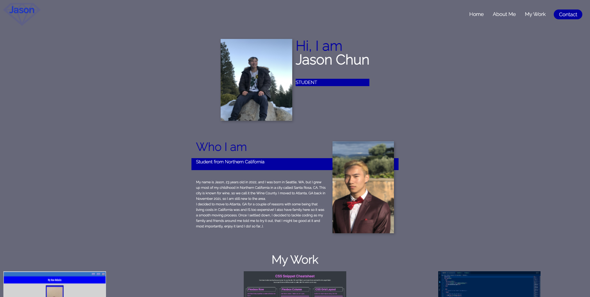

# Homework 2: Portfolio

## The Assignment

This week's homework was to build a portfolio from scratch with **no starter code**, which would be a challenge for anyone who's just getting into coding. But, I had a great time as it was an opportunity for me to learn more by doing it all by myself, with a couple of resources and references (mainly youtube tutorials).

Here is the **User Story** as well as the **Acceptance Criteria**:

## User Story

```
AS AN employer
I WANT to view a potential employee's deployed portfolio of work samples
SO THAT I can review samples of their work and assess whether they're a good candidate for an open position
```

## Acceptance Criteria

```
GIVEN I need to sample a potential employee's previous work
WHEN I load their portfolio
THEN I am presented with the developer's name, a recent photo or avatar, and links to sections about them, their work, and how to contact them
WHEN I click one of the links in the navigation
THEN the UI scrolls to the corresponding section
WHEN I click on the link to the section about their work
THEN the UI scrolls to a section with titled images of the developer's applications
WHEN I am presented with the developer's first application
THEN that application's image should be larger in size than the others
WHEN I click on the images of the applications
THEN I am taken to that deployed application
WHEN I resize the page or view the site on various screens and devices
THEN I am presented with a responsive layout that adapts to my viewport
```

## Usage

I've tried to make my first portfolio page the most user friendly as I can, with a simple navigation bar, 3 sections containing an intro, about me, and my work, and a footer with my contact information.



## Credits 

Throughout the developing of my portfolio, I followed a tutorial on youtube from a channel called 'freeCodeCamp.org' hosted by Kevin Powell. He was using mainly HTML and CSS properties that we've learned already, but there were some properties and elements that I didn't quite understand, and that's when I did some research to fully grasp what each element (especially in CSS) does and why it does it. 
- https://www.youtube.com/watch?v=_xkSvufmjEs&list=LL&index=2&t=6993s